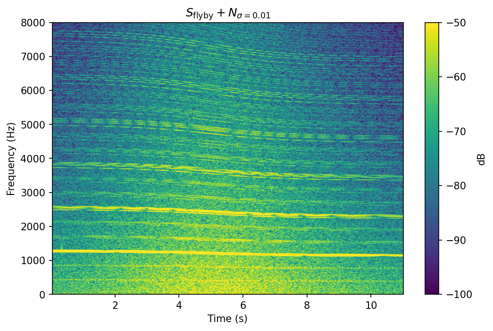
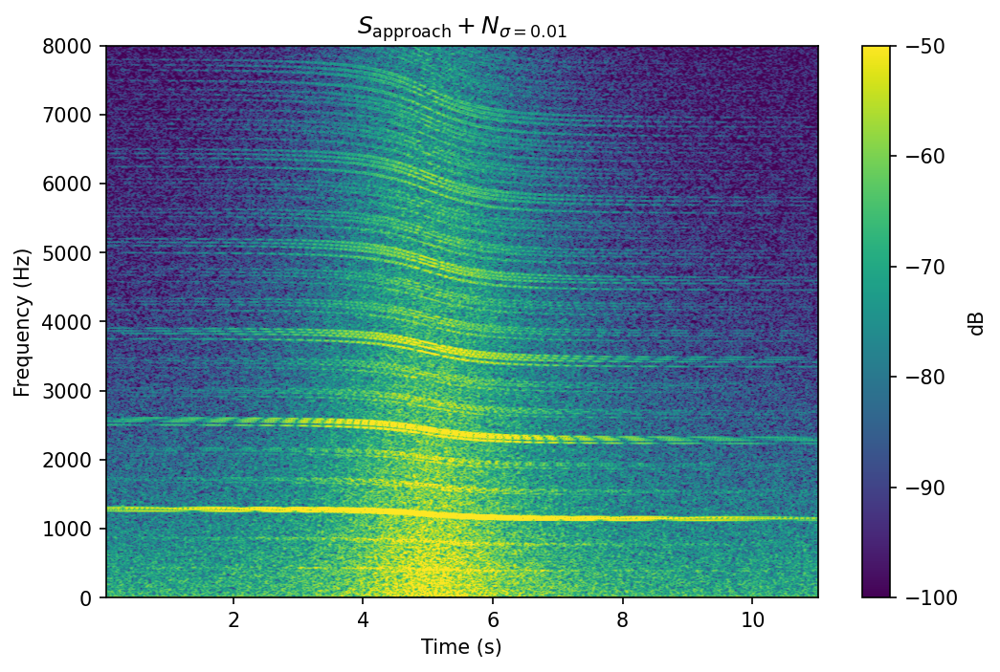
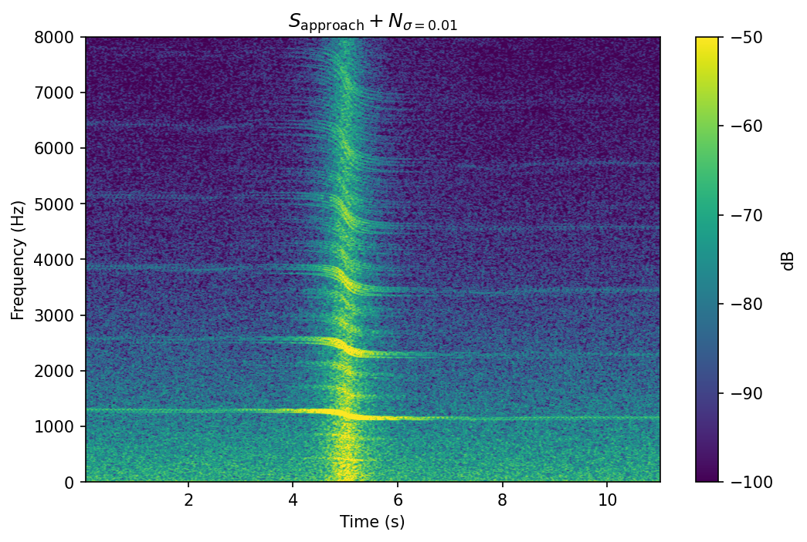
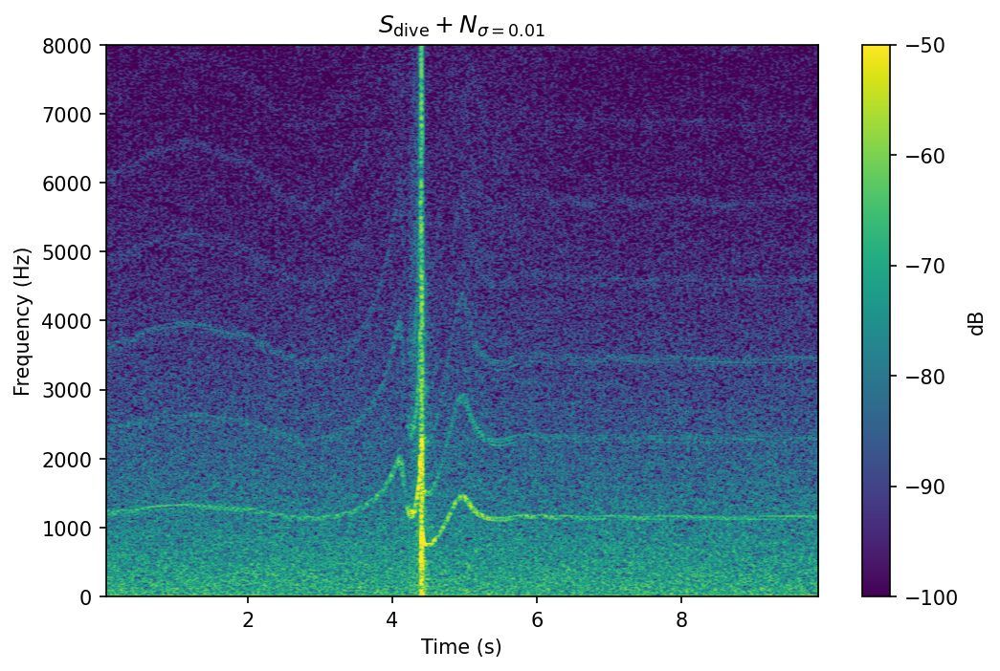

# drone-acoustic-analysis

An acoustic simulation of a 3-blade or 4-blade quadcopter drone is created for a two-microphone observer. 
Signal generation and acoustic propagation concepts are adapted from [1].

## Configuration
Key simulation parameters can be adjusted at the top of the notebook.

**Drone type:**
- `BASE_RPM` — motor speed (affects fundamental frequency f₀ = RPM/60)
- `N_BLADES` — number of blades (affects BPF = Nb·f₀)

**Flight profile:**
- `Z_HEIGHT` — flight altitude
- `SCENARIO` — flyby / approach / dive

## Signal Characteristics

The harmonic amplitudes are based on physical acoustic properties.

1. Signal characteristics have been calibrated against live drone outdoor recordings.
2. Blade passing frequency (BPF) (Nb·f0, 2·Nb·f0, ...) are dominant.
   Non-BPF harmonics are suppressed with exponential decay.
3. The four motors are given slight RPM variation to create realistic beating.
4. The phase per motor is given a uniformly random jitter.
5. 1/f² broadband noise is added for motor and aerodynamic noise.
6. The signal is normalized to RMS = 1.0.
7. Ground reflection is simulated by adding a scaled version of the signal.

The following is a spectrogram of the drone signal before propagating it through the acoustic setup.

## Acoustic Setup

1. Two microphones are positioned 30 cm apart on the x-axis, facing forward (facing the y-axis).
2. Wind turbulence at the microphone is simulated by 1/f³ black noise added to the propagated signal.
3. Three scenarios are simulated. Pre-generated audio files for each scenario are available in the `sounds/` directory.

a. "flyby": a drone flies laterally parallel to the observer at a constant height.

  
  

b. "approach": a drone approaches the observer orthogonally at a constant height.  
Flight altitude affects the steepness of the Doppler sweep.  At lower altitude, microphone turbulence masks weaker harmonics when the drone is distant. 

Altitude = 20 m

  
  

Altitude = 5 m

  
  

c. "dive": a drone approaches the observer orthogonally and dives to the ground at the observer's location. 

  
  

Note that at lower altitude, microphone turbulence masks non Nb harmonics when the drone is distant.

To view an interactive version with playable audio, open the notebook on [nbviewer](https://nbviewer.org/github/PhaseResponse/drone-acoustic-analysis/blob/main/drone_sound_simulation.ipynb)

## Upcoming features

1. Microphone modeling.
   - Obtain edge microphone recording w/ and w/o foam windscreen.
   - Tune microphone turbulence model with recordings.
2. Trajectory modeling.
   - Model drone stabilization motion pattern from recordings.
3. Detection and classification.
   - Algorithms:
     i. Classical algorithm for edge deployment.
     ii. ML-based.
   - Classes: drone/speech and flyby/approach/dive.
   - Augmentation: microphone turbulence frequency spectrum, drone trajectory parameters.
4. Two Channel Localization.

## References
[1] Herold G. Drone auralization example. Acoular Blog. 2024 Sep 21. https://blog.acoular.org/posts/auralization/drone-auralization-example.html

