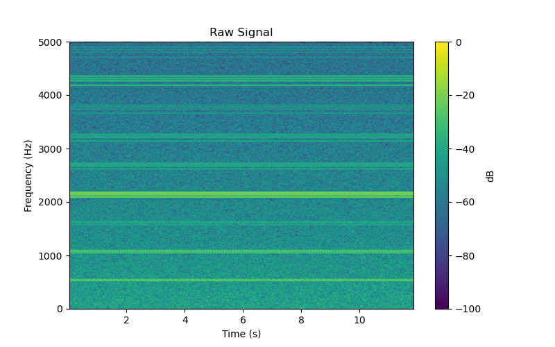
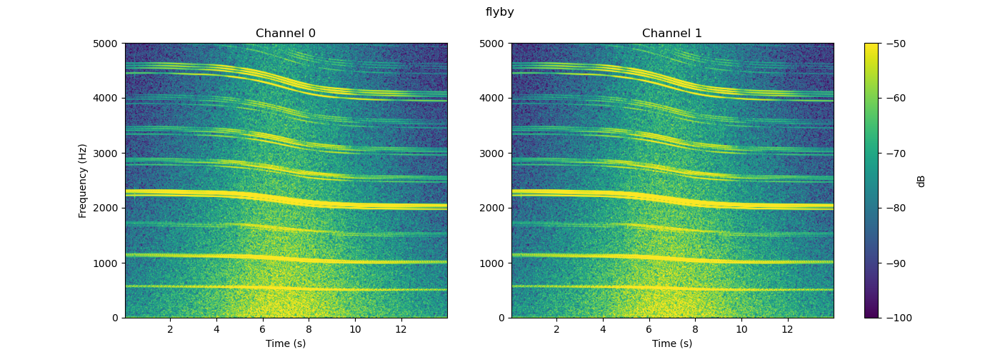
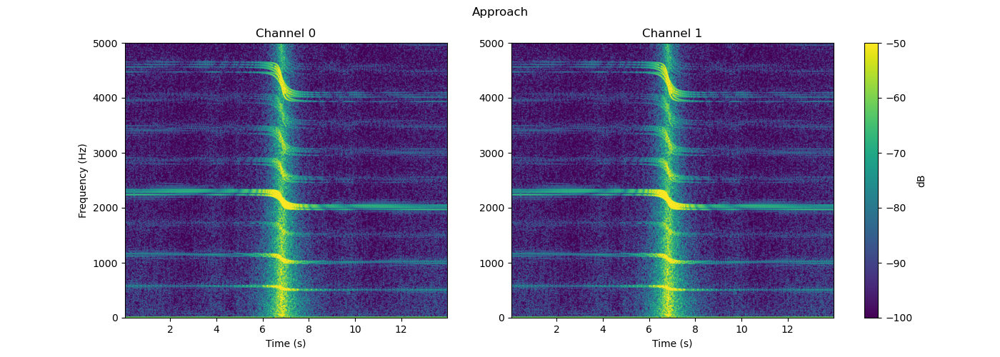
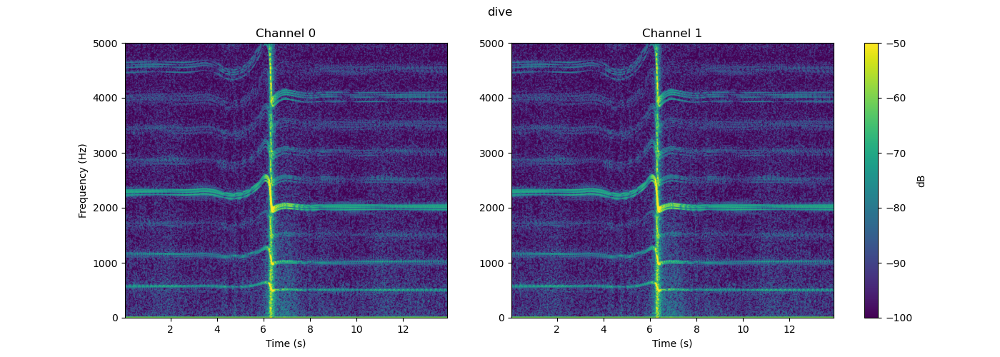

# drone-acoustic-analysis

An acoustic simulation of a 4-blade quadcopter drone is created for a two-microphone observer.  
Signal generation and acoustic propagation concepts are adapted from [1].

## Signal Characteristics

1. The harmonic amplitudes are based on physical acoustic properties: exponentially decaying, while f and 2f are enhanced for mechanical imbalance, 4f is the loudest because it is the dominant blade passing frequency (BPF), and 8f is a secondary BPF harmonic.
2. The four motors are given slight RPM variation to create realistic beating.
3. The phase per motor is given a uniformly random jitter.
4. 1/f² broadband noise is added.
5. The signal is normalized to RMS = 1.0.
6. Ground reflection is simulated by adding a scaled version of the signal.

The following is a spectrogram of the drone signal before propagating it through the acoustic setup.

## Acoustic Setup

1. Two microphones are positioned 30 cm apart on the x-axis, facing forward (facing the y-axis).
2. Three scenarios are simulated.  Pre-generated audio files for each scenario are available in the sounds/ directory.

a. "flyby", where a drone is flying laterally parallel to the observer at a constant height.

b. "approach", where a drone is approaching the observer orthogonally at a constant height. 

c. "dive", where a drone is approaching the observer orthogonally and diving to the ground at the observer's location.

## Upcoming features

1. Add wind turbulence noise at microphone.
2. Simulate effect of foam windscreen on microphone frequency response.
3. Add microphone noise floor.
4. Obtain live drone recordings in windy conditions.
5. Add environmental noise (birds, aircraft).
6. Add detection and classification: flyby / approach / dive (intended for edge deployment).  
   Augmentation parameters: wind speed and direction, noise level, distance, approach angle.

## References
[1] [Acoular drone auralization blog](https://blog.acoular.org/posts/auralization/drone-auralization-example.html). 
