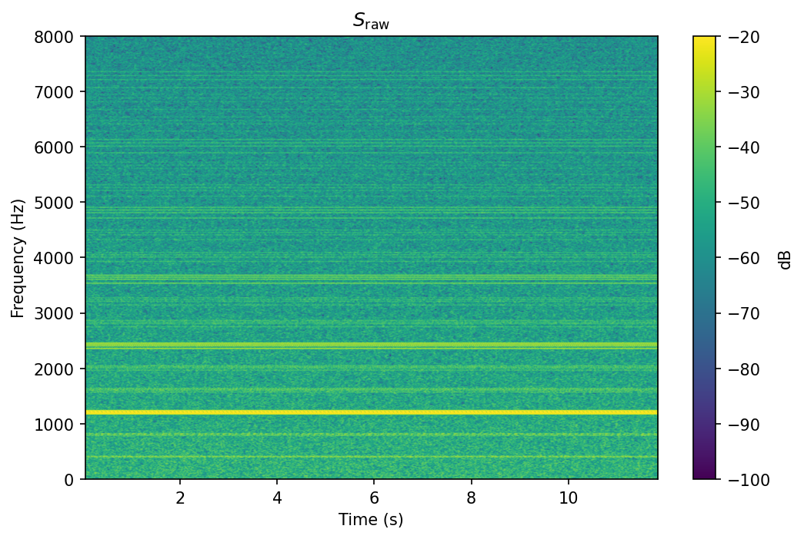
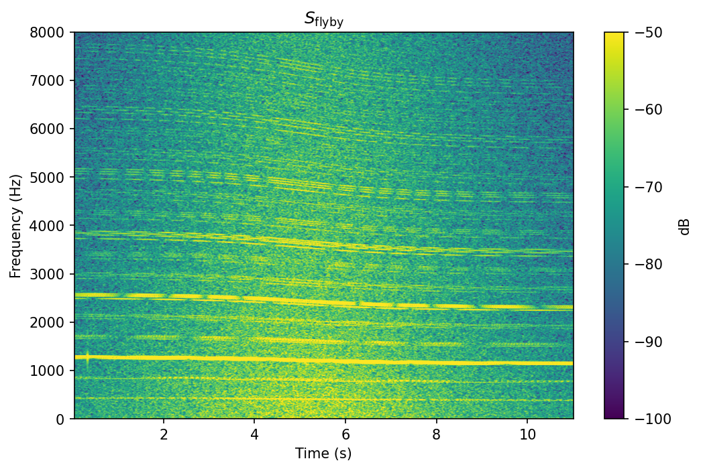
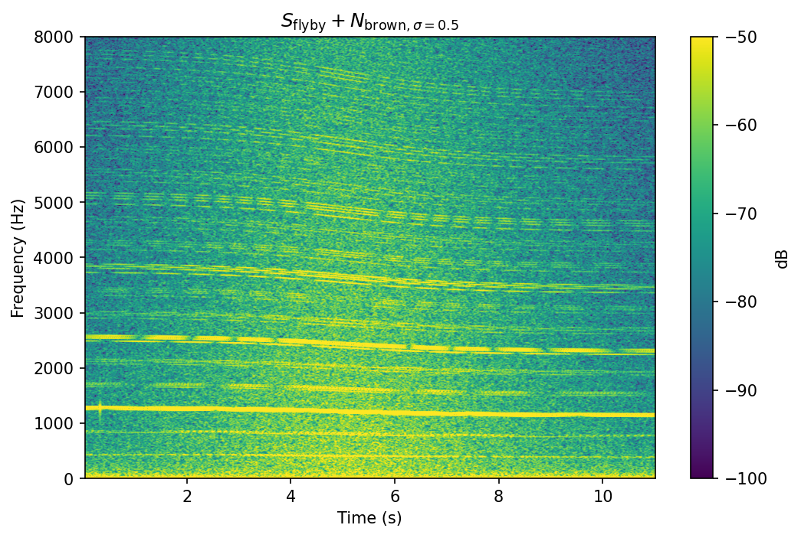
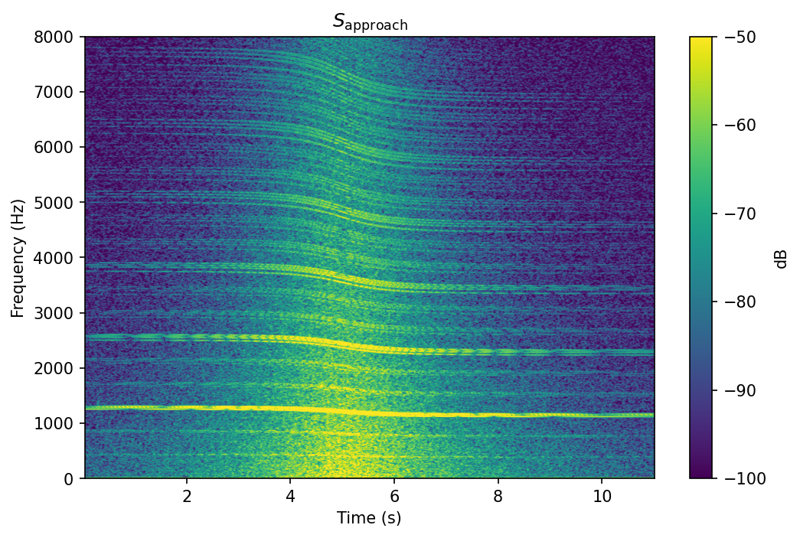
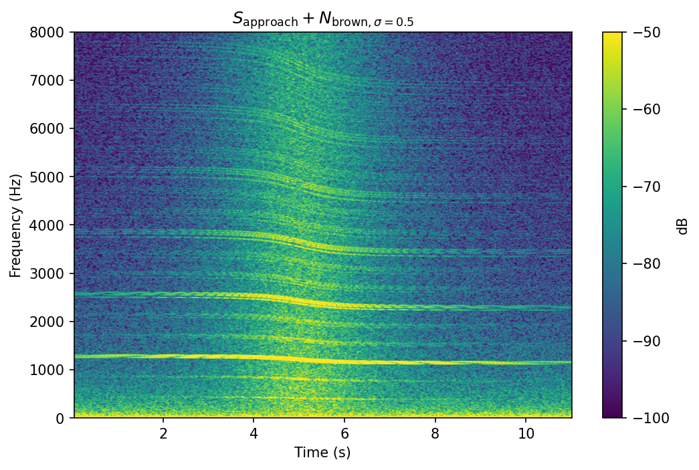
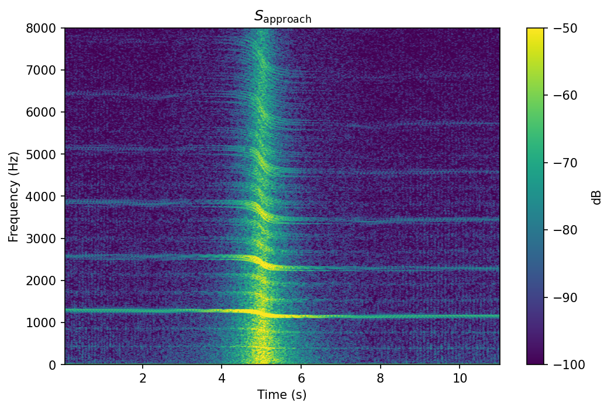
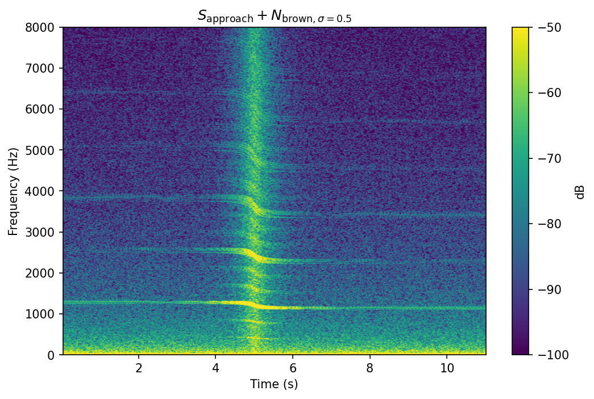
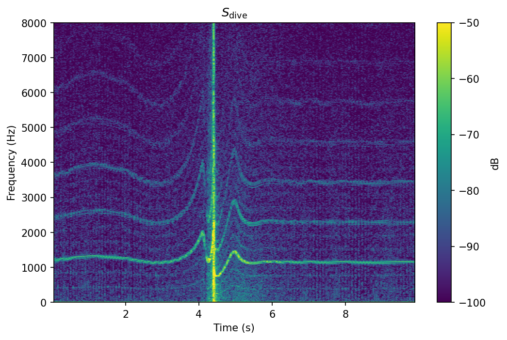
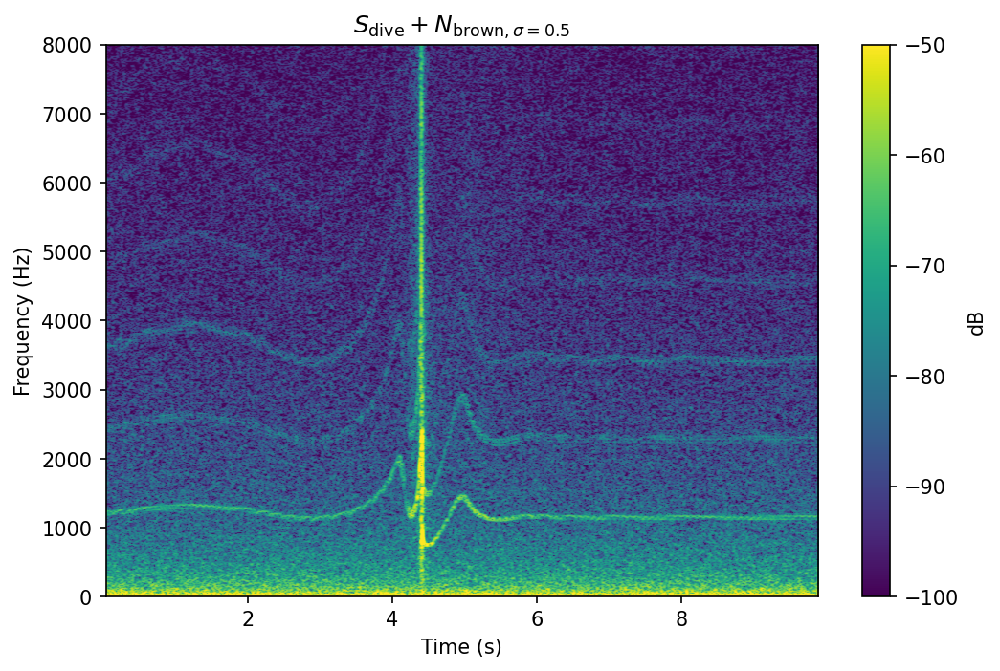
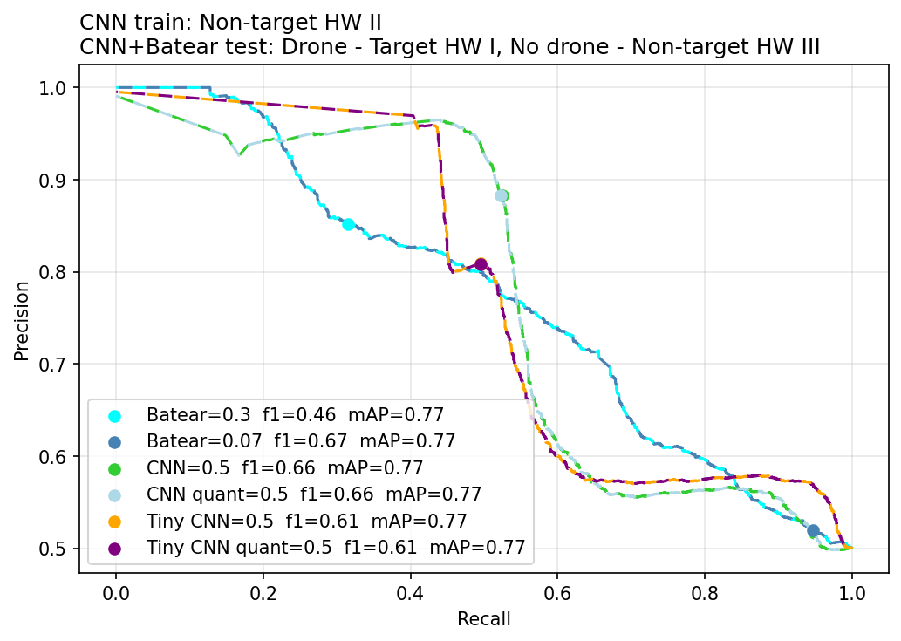

# drone-acoustic-analysis

An acoustic simulation of a 3-blade or 4-blade quadcopter drone is created for a two-microphone observer. 
Signal generation and acoustic propagation concepts are adapted from [1].  
A drone/no-drone classifier is developed for edge hardware.  

## Signal Characteristics

Signal characteristics are calibrated against live drone outdoor recordings.

1. Blade passing frequency (BPF) harmonics (Nb·f0, 2·Nb·f0, ...) are dominant.
   Non-BPF harmonics are suppressed with exponential decay.
2. The four motors are given slight RPM variation to create realistic beating.
3. The phase per motor is given a uniformly random jitter.
4. 1/f² broadband noise is added for motor and aerodynamic noise.

The following is a spectrogram of the drone signal before propagation through the acoustic setup.

## Acoustic Setup

1. Two microphones are positioned 30 cm apart on the x-axis, facing forward (facing the y-axis).
2. Ground reflection is simulated by a mirrored source trajectory below ground (-z), scaled by the reflection coefficient.
3. Wind-induced turbulence noise is simulated by independent 1/f² noise added to each microphone's propagated signal.
4. Three scenarios are simulated.  

a. "flyby": a drone flies laterally parallel to the observer at a constant height.

  
  

b. "approach": a drone approaches the observer orthogonally at a constant height.  
Flight altitude affects the steepness of the Doppler sweep. 

Altitude = 20 m

  
  

Altitude = 5 m

  
  

c. "dive": a drone approaches the observer orthogonally and dives to the ground at the observer's location. 

  
  

<!--  
To view an interactive version with playable audio, open the notebooks on nbviewer:
- [Drone sound simulation](https://nbviewer.org/github/PhaseResponse/drone-acoustic-analysis/blob/main/drone_sound_simulation.ipynb)
- [Microphone turbulence](https://nbviewer.org/github/PhaseResponse/drone-acoustic-analysis/blob/main/mic_turbulence.ipynb)
-->

## Classification

Batear algorithm is used as benchmark [2].  
PR curves show that edge-optimized CNN mAP is comparable to Batear mAP.  Quantization cuts memory in half, yet does not change the PR curve.  Conventional CNN f1-score slightly higher than "Tiny" model (depthwise separable convolutions), and significantly higher than Batear with default threshold.  CNN results expected to improve with additional application-specific Target HW data.  

## References
[1] Herold G. Drone auralization example. Acoular Blog. 2024 Sep 21. https://blog.acoular.org/posts/auralization/drone-auralization-example.html  
[2] Batear by TN, founder of batear.io: https://github.com/batear-io/batear
 
